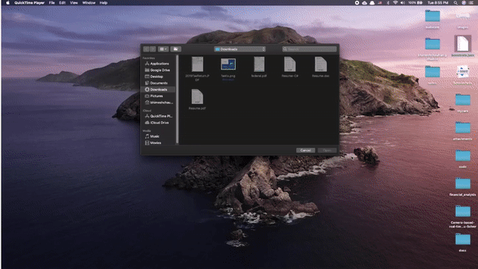

# drf-jwt-auth
Django Rest Framework - JSON Web Token Auhtentication with login and signup page.

## Steps to start

> source env/bin/activate
> pip install -r requirements.txt
> cd main
> python manage.py createsuperuser # Create Super User with preffered email and password
> python manage.py runserver

## Access

### admin
http://localhost:8000/admin

### apps
http://localhost:8000

### api
http://localhost:8000/api/{{your-app}}

## Demo

